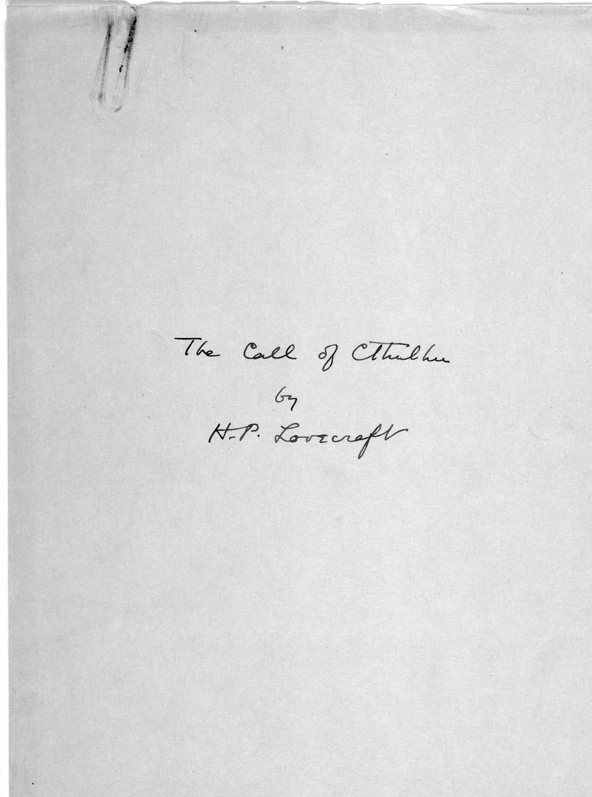
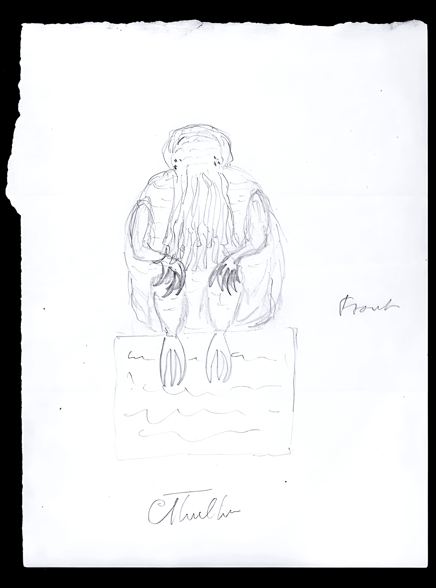

# Frontispício {.unnumbered .unlisted .hidden}

<section class="frontispicio-image-page" epub:type="frontmatter">
<figure class="full-page-figure" id="img-cthulhu-p1">

</figure>
</section>

# Frontispício {.unnumbered .unlisted .hidden}

<section class="frontispicio-image-page" epub:type="frontmatter">
<figure class="full-page-figure" id="img-cthulhu4">

</figure>
</section>

# O chamado de Cthulhu {.unnumbered .unlisted .hidden}

<section id="rosto" class="rosto" epub:type="titlepage">

**O chamado de Cthulhu**

H. P. Lovecraft

Dirceu Villa (*tradução e introdução*)

2ª edição

São Paulo, 2026

</section>

# Créditos {.unnumbered .unlisted .hidden}

**edição brasileira ©** Hedra 2026  
**tradução e introdução ©** Dirceu Villa  

**título original** *The Call of Cthulhu*, 1928  
**edição** Jorge Sallum e Luan Maitan  
**coedição** Suzana Salama  
**editor-assistente** Paulo Henrique Pompermaier  
**assistência editorial** Julia Murachovsky  
**revisão** Cristina Yamazaki  
**iconografia** Luan Maitan  
**capa** Lucas Kröeff  

**ISBN** 978-65-89705-31-4  
**edição digital** Luan Maitan  

<strong>Dados Internacionais de Catalogação na Publicação (CIP)</strong> (Câmara Brasileira do Livro, sp, Brasil)

Lovecraft, H. P., 1890&ndash;1937

<em>O chamado de Cthulhu</em>. H. P. Lovecraft; tradução e introdução de Dirceu Villa. 2. ed. São Paulo, sp: Hedra, 2025.

isbn 978-65-89705-31-4 isbn (digital) 978-85-7715-999-4

1&#46; Literatura americana. 2. Ficção. 3. Terror. i. Villa, Dirceu. ii. Título.

2025&ndash;1933cdd: 813.0876

Elaborado por Odilio Hilario Moreira Junior (CRB 8/9949)

<strong>Índices para catálogo sistemático:</strong> 1&#46; Literatura americana: Ficção (813.0876) 2&#46; Literatura americana: Ficção (821.111(73)-3)

&#160;

**Editora Hedra**  
R. Sete de Abril, 235, cj. 102  
01043-904 São Paulo SP Brasil  

**site** [hedra.com.br](https://www.hedra.com.br)  
**e-mail** [editora@hedra.com.br](mailto:editora@hedra.com.br)  
**instagram** [@editorahedra](https://www.instagram.com/editorahedra)

# Sobre o livro {.unnumbered .unlisted .hidden}

<section id="sobre" class="pretas" epub:type="prologue">

**O chamado de Cthulhu** (1928) apresenta a figura mais popular de Lovecraft, centro da série sobre os Grandes Antigos, as gigantescas e incompreensíveis criaturas anteriores a esta Terra. É a cristalização, numa imagem, de um tipo específico de terror chamado "cósmico": mas um cósmico íntimo e literário. Em seu Cthulhu, um monstro que dorme no fundo do mar — verde, sombrio, doentio, descomunal e de dimensões inqualificáveis —, o autor procedeu a uma metamorfose do próprio Kraken, monstro marinho e cefalópode da mitologia escandinava, para encontrar um código de seus próprios horrores: mas que funcionou bem, porque o verdadeiro mergulho no medo de um é o mergulho no medo de todos. Um dos grandes clássicos de horror do século xx, *O chamado de Cthulhu* permite um desconcertante passeio pelo universo macabro de um dos grandes mestres do horror.

**H. P. Lovecraft** (Providence [Rhode Island], 1890–*id*., 1937) demonstrou desde a infância interesse pelas artes e pelas ciências, logo se tornando um leitor precoce. Aos dois anos, viu o pai ser internado em um manicômio, onde permaneceria até morrer cinco anos mais tarde. Lovecraft continuou morando com a família, porém a mãe jamais se recuperou da perda e começou a sofrer distúrbios mentais que afetaram profundamente sua relação com o filho, criando laços doentios entre os dois. Após uma crise nervosa em 1908, quando ainda estava em idade escolar, Lovecraft abandonou para sempre os estudos e passou a levar uma existência reclusa até que, em 1914, descobriu o jornalismo amador. A partir de então principiou a publicar contos de horror e variados artigos em diversos periódicos, bem como a dedicar-se à vasta correspondência que manteria ao longo de toda a vida. Depois de perder a mãe em 1921 e de se casar em 1924, passou uma temporada de penúria em Nova York; esta, somada ao fracasso de seu casamento, obrigou-o a voltar para a casa de suas tias em Providence. Mesmo sem nunca ter alcançado a fama em vida, foi nesta época que Lovecraft escreveu alguns dos contos responsáveis por seu renome atual, como este *O chamado de Cthulhu*. Morreu em 1937, vítima de câncer do intestino.

**Dirceu Villa** é poeta, tradutor e ensaísta. Publicou cinco livros de poesia, *mcmxcviii* (1998), *Descort* (2003), *Icterofagia* (2008), *Transformador* (2014), *speechless tribes: três séries de poemas incompreensíveis*, e, entre outros, traduziu *Um anarquista e outros contos*, de Joseph Conrad (2009), *Lustra*, de Ezra Pound (2011), *Famosa na sua cabeça*, de Mairéad Byrne (2015) e "O anjo Heurtebise", de Jean Cocteau (2020). Doutor em Literaturas de Língua Inglesa pela usp (com estágio de doutorado em Londres), estudando o Renascimento na Inglaterra e na Itália, e pós-doutorado em Literatura Brasileira.

</section>